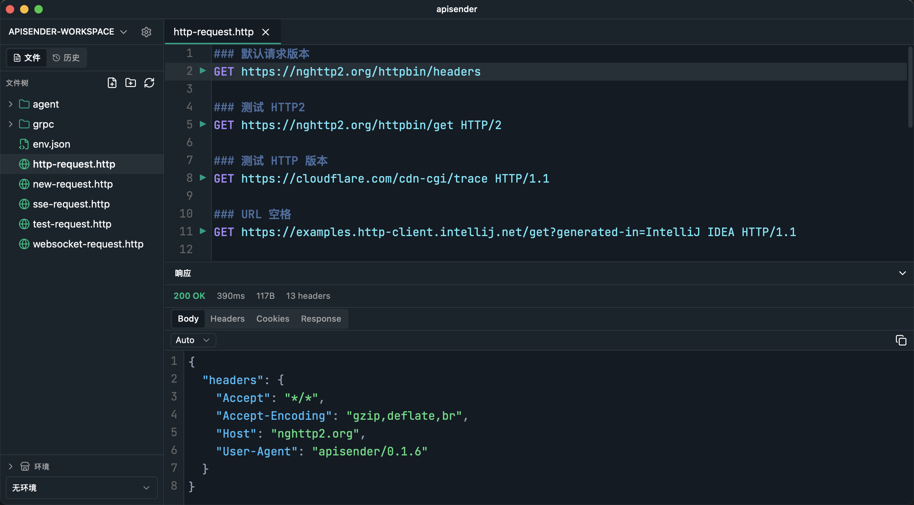

<p align="center">
    <a href="https://github.com/dxx/apisender">
        
    </a>
</p>
<h1 align="center">apisender</h1>

<p align="center">
HTTP / WebSocket / SSE / gRPC 请求客户端，类似 IntelliJ HTTP Client / VSCode REST Client 的桌面应用，基于 Tauri 2 构建。
</p>



点击[查看](./docs/screenshots.md)更多截图。

## 功能

- HTTP 请求（GET/POST/PUT/DELETE/PATCH 等，支持 multipart、变量插值）
- SSE 长连接，事件流实时渲染
- WebSocket 双向通信，支持多消息发送与 idle 超时
- gRPC（Unary + Server Streaming），支持 server reflection / proto 文件加载
- 工作区文件树管理、环境变量、历史记录、cURL 互转
- 跨平台：Windows / macOS / Linux

## 环境依赖

- [Node.js](https://nodejs.org/) ≥ 20
- [pnpm](https://pnpm.io/) ≥ 9
- [Rust](https://www.rust-lang.org/) ≥ 1.85（edition 2024）
- [Tauri 2 前置依赖](https://tauri.app/start/prerequisites/)（Windows: WebView2 + MSVC；macOS: Xcode CLT；Linux: webkit2gtk 等）

## 快速开始

```bash
# 安装前端依赖
pnpm install

# 启动开发模式（自动跑 Vite + Tauri）
pnpm tauri dev

# 类型检查
pnpm exec tsc --noEmit

# 打包发布
pnpm tauri build
```

## 下载 & 安装

从 [GitHub Releases](https://github.com/dxx/apisender/releases/latest) 下载最新版本。

### 平台选择

文件名格式统一为：`apisender-{ver}-{platform}-{arch}[-portable].{ext}`

| 字段 | 取值 |
|---|---|
| `ver` | 版本号（如 `0.1.6`） |
| `platform` | `macos` / `windows` / `linux` |
| `arch` | `arm64` / `x64` |
| `ext` | `dmg` / `msi` / `deb` / `AppImage` |
| `-portable` | 仅 Windows，免安装版（`.zip`） |

**示例**：

- macOS Apple Silicon：`apisender-0.1.6-macos-arm64.dmg`
- Windows x64 免安装：`apisender-0.1.6-windows-x64-portable.zip`
- Linux x64（Debian/Ubuntu）：`apisender-0.1.6-linux-x64.deb` 或 `.AppImage`

### 安装步骤

**macOS**：双击 `.dmg` → 拖入 `Applications`。

**注意**：由于本项目未购买 Apple 签名证书, 下载后会被 macOS Gatekeeper 拦截，把 `apisender.app` 拖进 `/Applications` 后，在终端执行:
```bash
xattr -cr /Applications/apisender.app
```

**Windows**：
- `.msi`：双击运行安装向导
- `portable.zip`：解压后双击 `apisender.exe`

**Linux**：

```bash
# Debian / Ubuntu
sudo dpkg -i apisender-{ver}-linux-x64.deb

# 任意发行版（AppImage）
chmod +x apisender-{ver}-linux-x64.AppImage
./apisender-{ver}-linux-x64.AppImage
```

ARM64 设备下载 `linux-arm64` 版本。

## 文档

详细文档说明见 [docs](./docs/)。
